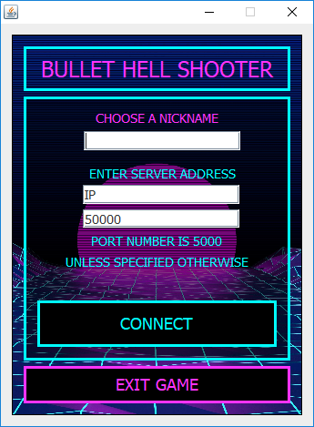
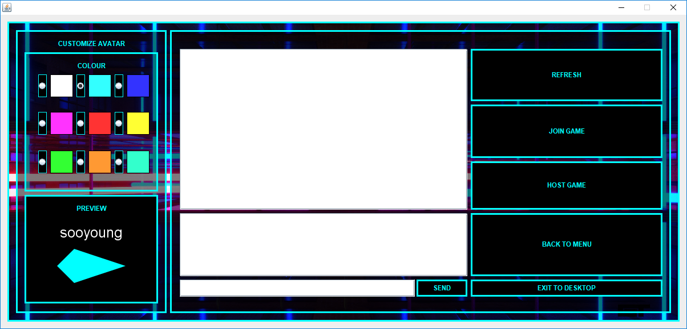
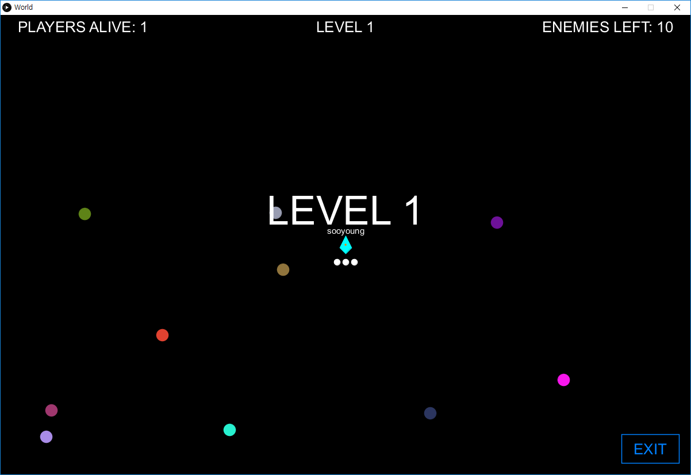
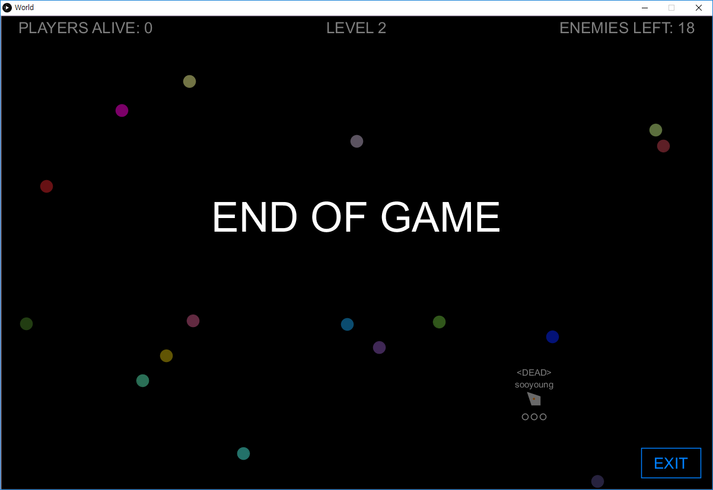

## Bullet Hell Shooter
A 2D shooting game made using Java and [Processing](https://processing.org/)

### Installation
Download the jar files of the latest [release](https://github.com/noreebia/bullet-hell-shooter/releases). Run the server, and then run the client and connect to the machine running the server (Most of the time, the server and client will be running on the same machine).

### Screenshots

Login

Lobby

In-game

End of game

